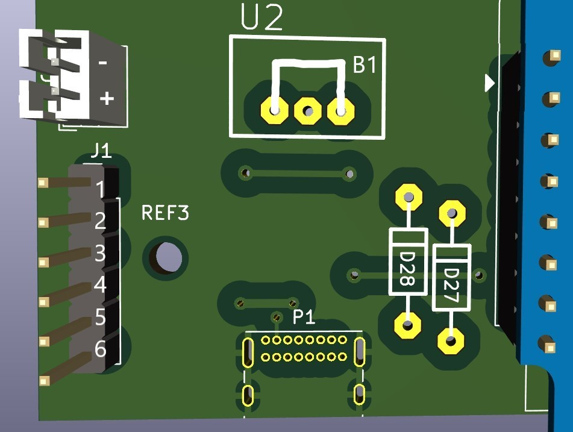

# Würfel 2.0

Projekt ESP8266 - D1 mini Matrix-Würfel mit Webserver

Umfasst eine LED Matrix, 3 Taster (davon 2 frei programmierbar) und eine einfache Website, welche leicht mit Funktionen erweitert werden kann.
Eine Möglichkeit ist der Tausch der serienmäßig verbauten 9V Batterie mit einem 3.7V Lithium Akku. Für dieses [Upgrade](#lithium-akku-upgrade) ist die Platine bereits vorbereitet.

## Repo Übersicht

### cad

Beinhaltet KiCad Projektdaten - Schaltplan und Platinenlayout.

### data

Beinhaltet Files für das Dateisystem

-   HTML Seiten
-   CSS Stylesheets
-   Icons und Bilder
-   Textdateien
    -   creds (SSID, Passwort, etc)
    -   settings (Timeoutzeiten)

### src

Quellcode

-   header_main.hpp - Macros und Header
-   main.cpp - Microcontroller Programmroutinen

## IDE & Framework

Das Projekt wurde in der [PlatformIO](https://marketplace.visualstudio.com/items?itemName=platformio.platformio-ide) Entwicklungsumgebung und mithilfe des Arduino Frameworks in Visual Studio Code realisiert. Die Erweiterung bezieht automatisch alle benötigten Libraries, welche in der [platformio.ini](https://github.com/sixteenlines/dice-2/blob/production/platformio.ini) hinterlegt sind.

In dieser werden auch die Einstellungen für den seriellen Monitor oder die entsprechenden Flags für den Programmer gesetzt.

## Dokumentation

### Einschalten

Das Einschalten des Geräts erfolgt mit dem linken Taster.

Der Controller versorgt sich über eine [Selbsthaltefunktion](https://github.com/sixteenlines/dice-2/blob/production/self-retain.jpg?raw=true) und schaltet so nach einiger Zeit (einstellbar über Webinterface) automatisch ab.

Ein manueller Reset ist über den Reset pin auf der Unterseite des Gehäuses möglich.

### AP-Mode

Beim Einschalten versucht der Controller sich mit den bekannten Daten in einem bestehendem WLAN als Client anzumelden. Misslingt dies nach 3 Versuchen, leuchtet ein roter Punkt in der Matrix auf und der Controller schaltet wieder ab.

Um die Anmeldedaten zu bearbeiten, kann das Gerät im Wifi-Manager-Modus gestartet werden. Hierzu wird beim Einschalten der mittlere Taster 5 Sekunden lang gedrückt gehalten. Der ESP hostet nun einen Access-Point und wird sichtbar als "MAGIC-DICE-SETUP".

Bei der Verbindung versucht der Controller DNS Anfragen auf ein Captive Portal umzuleiten um die Eingabemaske automatisch aufzurufen. Gelingt dies nicht, kann der Wifi-Manager über die [8.8.8.8](8.8.8.8) erreicht werden.

Nach Absenden des Formulars startet der Controller neu, bei erfolgreicher Verbindung im WLAN leuchtet ein grüner Punkt in der Matrix auf.

### Client-Mode

Wurde im Formular eine statische IP vergeben, kann man das Webinterface unter der eingestellten IP erreichen.

Wird DHCP verwendet kann die erhaltene IP über die [serielle Schnittstelle](#serielle-schnittstelle) ausgelesen werden.

Es kann nun über Betätigen des linken Tasters oder den Button im Webinterface gewürfelt werden.

Ebenso ist im Webinterface die Matrix als 
 Container widergespiegelt. Unter der Matrix kann die Farbe zum Würfeln eingestellt werden. Außerdem können individuelle LEDs angeklickt werden um sie in der gewählten Farbe aufleuchten zu lassen. Wiederholtes klicken schaltet sie wieder aus.

Über das Einstellungsmenü kann die Dauer der Beleuchtung und die Zeit bis der Controller abschaltet, konfiguriert werden.

Ebenso findet sich hier der WiFi-Manager wieder, falls in ein anderes Netzwerk gewechselt werden soll. Nach Eingabe muss jedoch der Controller erst [neu gestartet](#einschalten) werden.

### Offline-Mode

Wird beim Einschalten der rechte Taster bis zum Aufleuchten eines blauen Punktes gehalten, startet das Gerät im Offline-Modus. Hierbei wird das Wifi-Modul abgeschaltet um die Akkulaufzeit erheblich zu erhöhen. In diesem Modus ist jedoch lediglich die Würfel-Funktion verfügbar.

### Serielle Schnittstelle

Verbindet man das Gerät über USB, können mithilfe eines Terminalprogramms Debugging-Informationen und von DHCP erhaltene IP-Adressen ausgelesen werden.

Der Controller sendet standardmäßig mit einer Baudrate von 115200.

Zur Fehlerdiagnose ist ratsam, den Controller zu verbinden, die entsprechende serielle Schnittstelle zu öffnen und zunächst einen [reset](#einschalten) durchzuführen.

Es werden nun sämtliche Schritte des Bootvorgangs gespiegelt. Außerdem werden Anfragen an den Webserver gelogt.

## Lithium Akku Upgrade

Um das Gerät mit einem wiederaufladbarem Akku auszustatten müssen einige zusätzliche Teile bezogen werden. In Klammern jeweils aufgeführt, ist der verwendete Footprint auf der Platine oder eine Teileempfehlung.

1x 2.0 USB-C Port (GCT-USB4085)

1x 3.7V Lithium Akku (LiPo 103450 - 51mm x 39mm x 10mm)

1x LiPo Laderegler mit DC-DC Converter 3.7V - 5V

1x Drahtbrücke (0.6mm)

1x Klebestreifen für Akku ([iFixit Klebestreifen](https://store.ifixit.de/products/stretch-release-battery-adhesive))

Optional:

1x JST-PH2 Header oder JST-XH2 oder JST-EH2 je nach Akku/Hersteller (siehe Datenblatt)

Die bereits verbaute Steckleiste J1 ist ausgelegt auf ein [kompaktes Modul](https://de.aliexpress.com/item/33034500618.html) mit DC-DC Wandler und Laderegler. Wird von diesem abgewichen, ist auf eine [korrekte Pinbelegung](https://github.com/sixteenlines/dice-2/blob/production/cad/screenshot/dcdc_charge_header.jpg?raw=true) nach Schaltplan zu achten. Auch ist die korrekte Polarität beim direkten Verlöten der Akku Litzen, oder Bestücken des JST-Headers zu prüfen.

### Arbeitsschritte:

1. Öffnen des Gehäuses (Schraubendreher) und Entfernen der 9V Blockbatterie (Seitenschneider)

2. Entfernen des TSR1-2450 (U2)

3. Bestücken und Verlöten von Drahtbrücke B1 (Pin 1 - Pin 3 von U2)

4. Bestücken und Verlöten von THT 2.0 USB Connector

5. Bestücken und Verlöten des optionalen JST-Headers oder verlöten der Akku Litzen

6. Einsetzen des DCDC-Charge Controller Moduls

7. USB Ladegerät anschließen und verifizieren, dass die Charge LED des eingesetzten Moduls aufleuchtet.

8. Akku mit Klebestreifen an die Stelle der alten 9V Batterie verkleben und Gehäuse wieder schließen.

